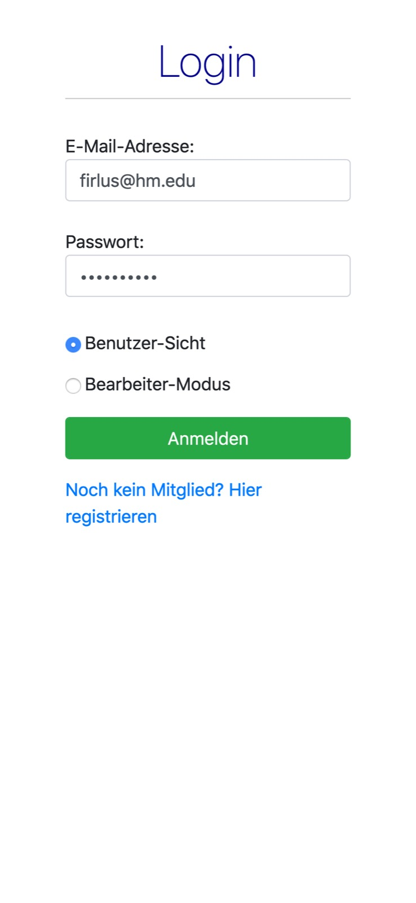
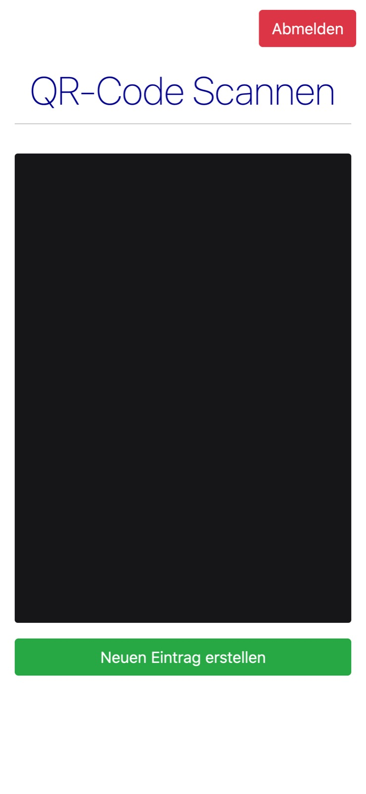
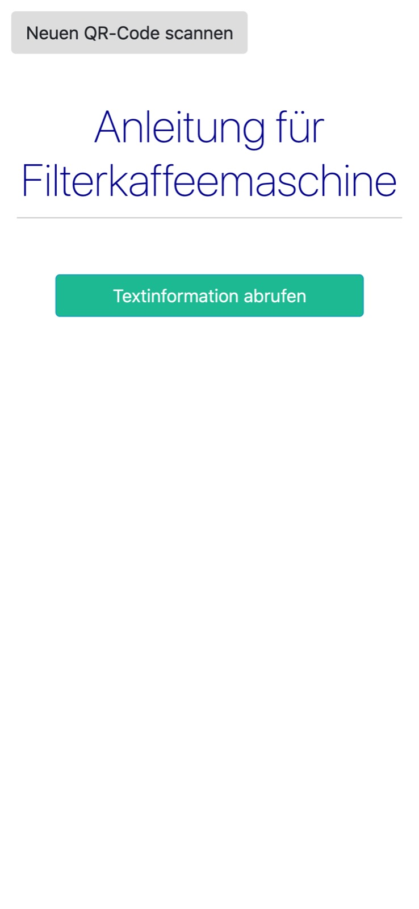
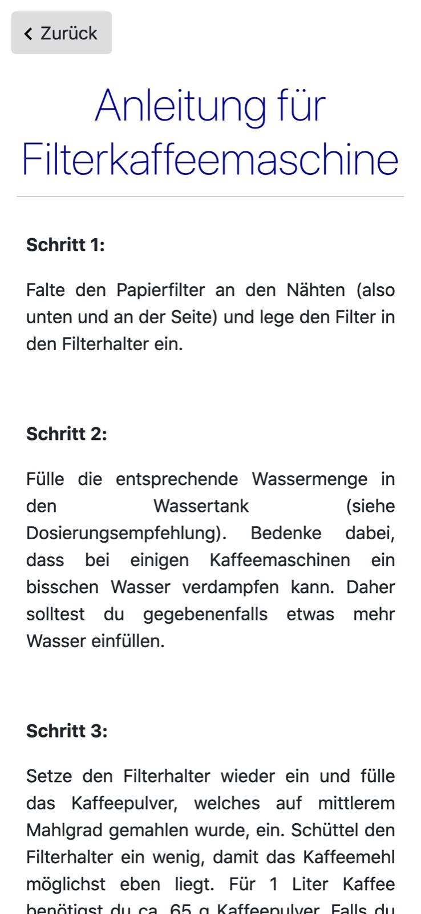
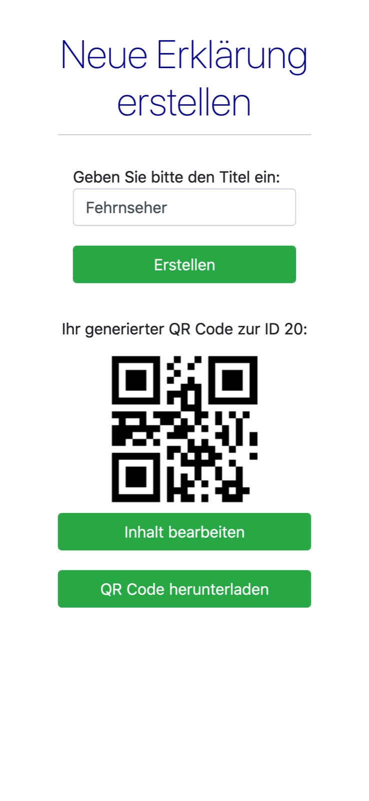
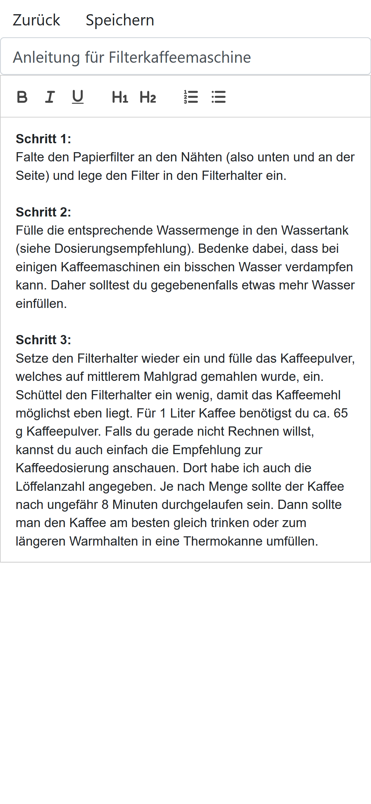

# AlzheimerApp, eine Informations- und Gedächtnishilfe für Alzheimererkrankte

## Algemeines

In einem Projekt mit Beteiligung von Amazon Web Services und der Deutschen Alzheimergesellschaft wurde von einer Gruppe aus sechs Studenten eine App entwickelt,
die Alzheimer-Patienten im Alltag helfen soll.

## Übersicht

Die Entwickelte Anwendung arbeitet mit Hilfe von QR-Codes, welche an Alltagsgegenständen angebracht sind 
(beispielsweise Kaffeemaschine, Fernseher usw.) und stellt so Erklärungen und Bedienungsanleitungen bereit. Alles was man sich nicht merken kann/will, kann dadurch digital gespeichert werden und physisch an einem gewünschten Ort/Gegenstand befestigt werden.

## Problem

Bereits nicht alzheimererkrante Menschen benötigen Notizen um sich an alles erinnnern zu können.
Mit fortschreitender Krankheit werden immer Umfangreichere Notizen/Erinnerungen benötigt, damit man den Alltag wie gewünscht meistern kann.
Unsere Aufgabe war es eine Anwendung zu Entwickeln, die Erkrankten den Alltag erleichtert indem die Anwendung alles was die Patienten sich nicht merken können digital speichert. Die Informationen werden durch einen qr-Code auch physisch zugänglich gemacht.

## Idee

Die Idee war es die Funktionsweise von Notizzetteln und Post-its zu erweitern, indem man sie mit dem Digitalen vereint.

Die Anwendung soll die Vorteile dieser Formen der Informationsspeicherung vereinen und dadurch die Nachteile minimieren.

**Post-its**
 
 Vorteile:
 + klein und handlich
 + Information kann direkt an Ort/Gegenstand angebracht werden, an dem sie benötigt wird
 

 Nachteile:
 - wenig platz für Informationen
 - nur Textinhalt möglich
 - "bei Verlust weg"

**Notizzettel**
 
 Nachteile:
 - unhandlich
 - durch Handschrift schnell unübersichtlich bei einer vollgeschriebenen Seite
 - nur Textinhalt möglich
 - "bei Verlust weg"

 Vorteile:
 + meist ausreichend Platz

**Digital**

 Vorteile:
 - annähernd unbegrenzter speicher
 - ebenso Bilder möglich sowie Audio- und Video-Inhalte
 - großzahl an Informationen kann durch gutes Layout trotzdem übersichtlich sein

 Nachteile:
 - Bedienbarkeit kann schnell zu komplex sein
 - Zugriff auf gewünschte Inhalte teilweise unpraktisch

=> es wurde eine Lösung gesucht, die ...

- handlich ist
- übersichtlich ist
- Information direkt an dem betroffenem Gegenstand zur Verfügung stellen kann
- bei Verlust die Informationen einfach wiederhergestellen kann
- mehr Informationen beinhalten kann
- andere Informationsformate unterstützt
- einfach zu bedienen ist

## Lösung

Die meisten dieser Punkte vereinigte eine Lösung bei der die Informationen in Text-, Audio-, und Videoformaten online gespeichert werden kann. 
Wobei die zuvor gespeicherten Informationen physisch, in Form eines Qr-Codes an einem beliebigen Gegenstand befestigt werden.
Dabei wurde darauf geachtet, dass die Erstellung eines neuen Qr-Codes in möglichst wenig Schritten zu realisieren ist. Dadurch sollen nicht nur Betreuer, sondern auch die Patienten selbst neue Qr-Codes erstellen können.
Durch das Scannen eines Qr-Codes gelangt man direkt zu dessen Informationen, die online hinterlegt wurden. (=> leichte bedienung)
Falls ein Qr-Code verloren geht, kann dieser auch erneut ausgedruckt werden.

## Bedienung der Anwendung

Wenn man die Anwendung startet wird man als erstes auf eine Seite zur Anmeldung weitergeleitet. Auf dieser meldet man sich mit seinen Account Daten.
In diesem Bildschirm legt man auch fest ob man ein Benutzer(Alzheimerpatient) oder ein Bearbeiter(z.B. Angehörige*r) ist.
Hat man noch keinen Account erstellt kann man sich auch einen neuen Account erstellen indem man auf "Hier registrieren" klickt.
Wenn man das tut, wird man auf eine Seite weitergeleitet bei der man sich einen neuen Account erstellen kann.
Hat man sich dann mit seinem Account eingeloggt gelangt man auf die QR-Code Scan Seite auf welcher man als Bearbeiter auch die Möglichkeit hat einen neuen QR-Code anzulegen.

Hier ist die Bedienung sehr einfach, da man lediglich den QR-Code mit der eigenen Kamera scannen muss und dann automatisch zu den dafür hinterlegten Inhalten kommt.
Außerdem kann man sich von seinem Account abmelden indem man den Knopf "abmelden" betätigt.

Auf dieser Seite wählt man dann die Inhaltsform(Text, Audio, Video) aus die man sehen möchte.(zum jetzigen Stand ist nur Text implementiert).
Zusätzlich hätte man auf dieser Seite auch die Möglichkeit als Bearbeiter den hinterlegten Inhalt in einem Texteditor zu verändern, wenn man den entsprechenden Knopf drückt.
Hier hat man auch die Möglichkeit wieder auf die QR-Code Scan Seite zurückzugelangen indem man oben links den Knopf "neuen QR-Code scannen" betätigt.

So sieht dann zum Beispiel der hinterlegte Text aus. 
Wie man sieht hat man hier einen sehr übersichtlichen Text der eine schrittweise Erklärung für die Bedienung einer Kaffeemaschine liefert.
Mit dem Knopf "zurück" gelangt man wieder auf die Inhaltsübersichtsseite.

Wenn man als Bearbeiter den Knopf "neuen QR-Code erstellen" auf der QR-Code Scan Seite betätigt wird man auf einer neuen Seite dazu aufgefordert einen Titel einzugeben.
Zum Beispiel Fernseher.
Dann muss man nur noch den Knopf "erstellen" betätigen und bekommt den QR-Code angezeigt. 
Wenn man auf QR-Code herunterladen geht kann man diesen auch ausdrucken.
Außerdem kann man auch von hier direkt den hinterlegten Inhalt bearbeiten indem man auf "Inhalt bearbeiten" drückt, welcher den Benutzer zu einem Texteditor weiterleitet.

Dieser bietet grundlegende Optionen um den Text anschaulicher zu gestalten, zum Beispiel fett- oder kursivdruck, sowie die Möglichkeit Stichpunkte und Listen zu erstellen.
Hier kann man auch den Titel des QR-Codes ändern, wenn man beispielsweise den QR-Code von der Kaffeemaschine an die Waschmashine hängen und deshalb auch den Namen ändern möchte.
Mit dem Knopf "speichern" werden die geänderten Inhalte gespeichert und man gelangt wieder auf die Inhaltsübersichtseite.
Wenn man den Knopf "zurück betätigt" gelangt man ohne die Inhalte zu speichern wieder zur Inhaltsübersicht zurück.

## Zusammenfassung

Zusammenfassend lässt sich zu unserer Anwendung sagen, dass sie die Vorteile der physischen schon vorhandenen Lösungen dieses Problems mit den Erleichterungen die durch die Digitalisierung entstanden sind vereint, um dadurch allen Betroffenen den Alltag zu erleichtern.

### Erstellte Dokumente bei der Projektplanung

Bei der Planung unseres Projekts haben wir [Wireframes](https://gitlab.lrz.de/swe1ws20192020/g4/blob/047-Readme/documents_development_process/Wireframes.pptx) zur Hilfe gezogen.
Diese liefern bei der ersten Planung des Projekts einen groben Überblick darüber wie das Endprodukt aussehen soll. Allerdings sind Funktion und Design nicht in Stein gemeißelt, sondern können sich während der Entwicklung ändern.
Als nächstes haben wir einen [Press Release](https://gitlab.lrz.de/swe1ws20192020/g4/blob/047-Readme/documents_development_process/Press_Release%20Gruppe%204.pdf) geschrieben.
Dieser wird bei der Veröffentlichung eines neuen Produktes von den Herstellern erstellt und soll möglichen Kunden einen Überblick bieten welche Funktionen das Produkt hat und auch wie es diese umsetzt.
Außerdem haben wir auch [User Stories](https://gitlab.lrz.de/swe1ws20192020/g4/blob/047-Readme/documents_development_process/UserStories.pdf) geschrieben, welche beschreiben, welche Funktionen den Benutzern wichtig sind.
Diese helfen dabei whärend der Entwicklung sich auf die Funktionen zu konzentrieren, die auch von Kunden gewollt werden.
Schlussendlich haben wir auch [FAQs](https://gitlab.lrz.de/swe1ws20192020/g4/blob/047-Readme/documents_development_process/FAQs%20Softwareengeneering.pdf) erstellt, welche Benutzern die Fragen die man sich oft fragt,
zum Beispiel wie viel die Anwendung kostet, auf einer übersichtlichen Seite beantwortet.
